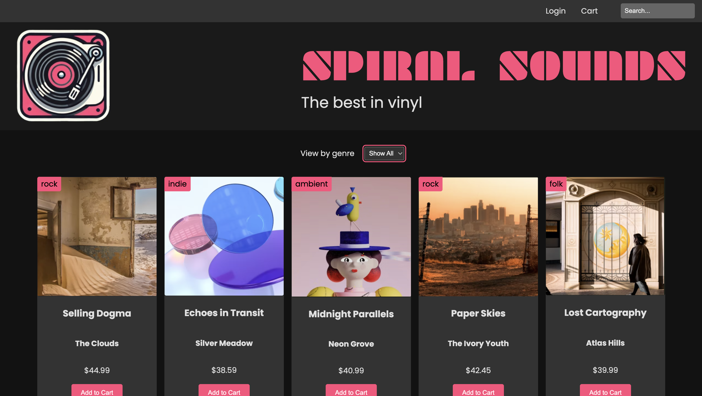

# Spiral Sounds - Online Vinyl Store



A modern web application for browsing and purchasing vinyl records. Built with Node.js, Express, and SQLite.

## Features

- **Product Browsing** - Browse a curated collection of vinyl records
- **Search Functionality** - Search by title, artist, or genre
- **Genre Filtering** - Filter records by music genre
- **Stock Management** - Track available inventory for each record
- **Responsive Design** - Works seamlessly on desktop and mobile devices

## Tech Stack

- **Backend**: Node.js, Express.js
- **Database**: SQLite3
- **Frontend**: HTML5, CSS3, Vanilla JavaScript
- **Development**: Nodemon (auto-reload)

## Project Structure

```
├── server.js                  # Express server entry point
├── package.json              # Project dependencies
├── database.db               # SQLite database (auto-generated)
│
├── /controllers
│   └── productsControllers.js # API business logic
├── /routes
│   └── products.js           # API route definitions
├── /db
│   └── db.js                 # Database connection utility
│
├── data.js                   # Seed data for vinyl records
├── createTable.js            # Database schema setup
├── seedTable.js              # Database population script
│
└── /public
    ├── index.html            # Main client page
    ├── index.js              # Client-side JavaScript
    ├── index.css             # Styling
    └── /images               # Album artwork
```

## Installation

1. **Clone the repository**

   ```bash
   git clone https://github.com/Namdo2465/Vinyl_Store.git
   cd Vinyl_Store
   ```

2. **Install dependencies**

   ```bash
   npm install
   ```

3. **Set up the database** (one-time setup)
   ```bash
   node createTable.js
   node seedTable.js
   ```

## Usage

### Development Mode (with auto-reload)

```bash
npm run dev
```

The server will start on `http://localhost:8000`

### Production Mode

```bash
npm start
```

The server will start on `http://localhost:8000`

## API Endpoints

### Get All Products

```
GET /api/products
```

Returns all products or filtered results based on query parameters.

**Query Parameters:**

- `search` - Search by title, artist, or genre (case-insensitive)
- `genre` - Filter by exact genre match

**Examples:**

```
GET /api/products?search=rock
GET /api/products?genre=indie
GET /api/products?search=silver&genre=indie
```

### Get All Genres

```
GET /api/products/genres
```

Returns an array of all available music genres in the database.

## Database Schema

### Products Table

```sql
CREATE TABLE products (
  id INTEGER PRIMARY KEY AUTOINCREMENT,
  title TEXT NOT NULL,
  artist TEXT NOT NULL,
  price REAL NOT NULL,
  image TEXT NOT NULL,
  year INTEGER,
  genre TEXT,
  stock INTEGER
)
```

## Available Scripts

| Script                | Description                               |
| --------------------- | ----------------------------------------- |
| `npm start`           | Start production server                   |
| `npm run dev`         | Start development server with auto-reload |
| `node createTable.js` | Create the products database table        |
| `node seedTable.js`   | Populate database with seed data          |

## Dependencies

- **express** - Web framework for Node.js
- **sqlite3** - SQLite database driver
- **sqlite** - Promise-based SQLite wrapper
- **nodemon** (dev) - Auto-reload development tool

## Future Enhancements

- Add shopping cart functionality
- Implement user authentication
- Add order history and checkout
- Integrate payment processing
- Add product reviews and ratings

## License

ISC

## Author

Nam Do
